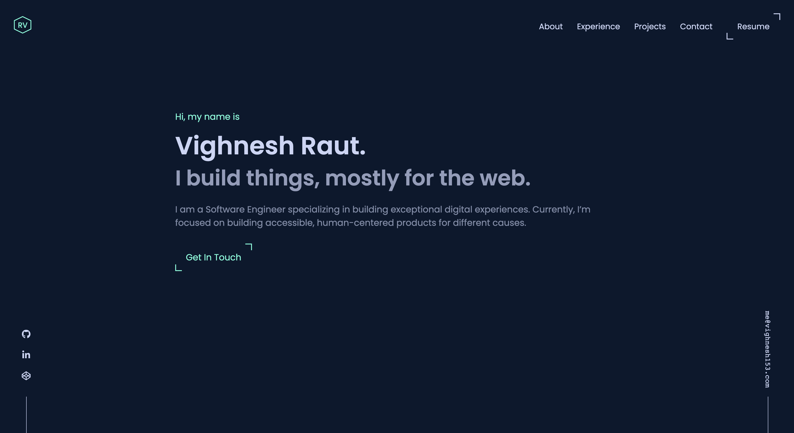

<div align="center">
    <a href="https://vighnesh153.com">
        
    </a>
</div>

<h1 align="center">vighnesh153.com - v2</h1>
<p align="center">
    The second iteration of 
    <a href="https://vighnesh153.com">vighnesh153.com</a>
    built with 
    <a href="https://nextjs.org/">NextJS</a> 
    and hosted on 
    <a href="https://vercel.com/">Vercel</a>
</p>
<p align="center">
    Previous iterations: 
    <a href="https://v1.vighnesh153.com">v1</a>
</p>



## 🚨 Forking this repo
Feel free to fork this repo and edit the config files with your data. 
Just be sure to not remove attributions to me (for building this) and 
Brittany (for designing this), from the footer.

## 🛠 Installation and Setup
1. Install and use the correct version of Node using [NVM](https://github.com/nvm-sh/nvm)
```shell
nvm install
```
2. Install dependencies
```shell
npm install
```
3. Start the development server
```shell
npm run dev
```

## 🚀 Building for Production
1. Generate static + ssg production build
```shell
npm run build
```
2. Start the production build
```shell
npm start
```
